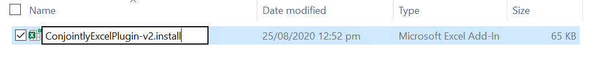
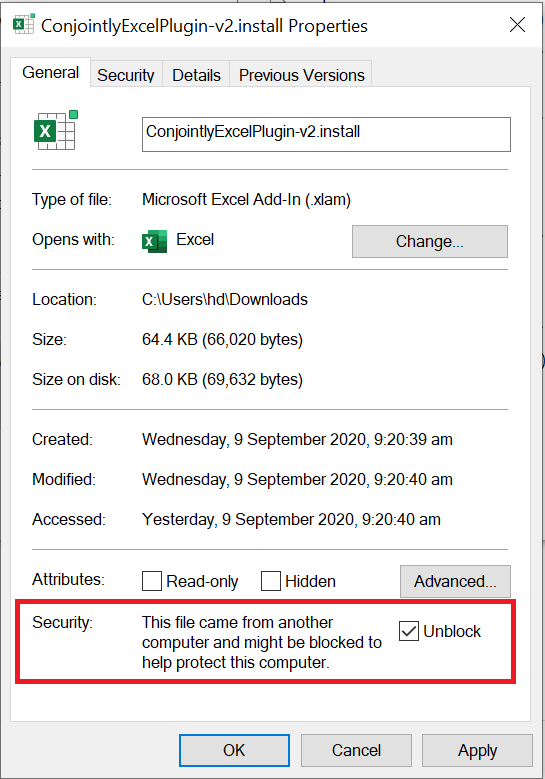
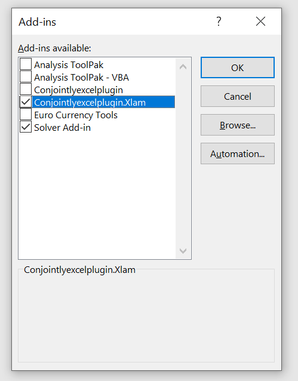

# Conjoint.ly Excel plugin
A free companion plugin for Excel that helps with charting [Conjoint.ly](https://conjointly.com/) outputs, including simulations charts from the Conjoint.ly [online simulator](https://conjointly.com/guides/conjoint-preference-share-simulator/) (scenario modelling and [price elasticity](https://conjointly.com/guides/understanding-price-elasticity-of-demand/) charts), colouring for [TURF analysis](https://conjointly.com/blog/turf-analysis/), and other useful utility functions.

## Table of Contents

* [Installiation Guide (Windows 10)](#installation-guide-windows-10)
* [How to remove from Excel](link)
* [Tool Bar Functionality](#tool-bar-functionality)
* [Elasticity Function](#elasticity-function)

### Installation Guide (Windows 10)

To install the plugin first <a download href="https://github.com/Conjoint-ly/excel-plugin/raw/master/ConjointlyExcelPlugin-v2.xlam">download the file</a>, then clicking the button Download. 

  

Once the file is downloaded, move the file to an apropriate location in your file system. Rename the file to ConjointlyExcelPlugin-v2.install.

Right click on the file and select properties. At the bottom of the pop up box is the option to unblock the file. Select unblock and then apply.

Once this is completed, close all current instances of Microsoft Office. By double clicking on the file you will be prompted with the following message. 

Select Yes to confirm the installation. To confirm that the program has installed successfully, check that the tab Conjoint.ly now appears at the top of your screen.

##### Optional Step - Previous Conjoint.ly Plugin Installed 
If you have installed the Conjoint.ly Plugin before September 2020, you will need to disable the exisiting plugin.

To do this, navigate to `Options` - `Excel Add-ins`. Select `Go` in the bottom left hand corner of the screen.

You will now have `Conjointlyexcelplugin.Xlam` installed as well as `Conjointlyexcelplugin`. Deselect the non xlam variant

### Tool Bar Functionality

| Button  | Functionality |  
| --------------------------------|--------------------------------------------------------------|
|   | Opens the user's default browser and redirects to [Conjoint.ly](https://conjointly.com/) |
|  | This function will **draw solid borders** around all currently highlighted cells. The text in the top row will be bolded.|
|  | Places the text from the leftmost selected cell across all selected cells. This gives the **apparence of merged cells**, but when referencing the cells only the first cell will contain a value, the rest will be empty.|
|  | This function is designed to be an easy way to **recolour your charts based on the fill color of the data cells it is based on**. To use this function, first change the background colour of your data cells to the colour you wish to be displayed for that range on your chart. Selecting the chart and then the selecting the function will open a prompt where you can select how you want the colours to be applied. Once the options are selected, the colours will be applied to your chart. The font will also be changed to Helvetica Neue 11pt. |
|  | **Creates an index of each Excel tab** within the work book. The index is fully linked, so the title of each tab is selected the tab will be opened  | 
|  | This function will apply formatting such that **values appraoching zero will be hidden**. To use this function, select a graph that you want to hide zeros on. Once the function is used it will apply formatting to the underlying dataset to hide values approaching zero|
|  | This function **transforms conditional formatting to to static formatting**. This allows the formatting to be copied onto different data points while not changing. To use the function, highlight the cells that you want converted then select the function. Note that this does not work for Excel's `Data Bars`|
|  | When used, this function will **show all precedents and dependents for the selected cells in a pop up box**, rather than showing arrows (Which occurs with the inbuilt Excel tracing)|

### Elasticity Function
`ELASTICITY(Quantity1, Quantity2, Price1, Price2)`

Price elasticity of demand (PED) is a measurement of how quantity demanded is affected by changes in price, i.e. it shows how demand for a product increases or decreases as its price increases or decreases. 

This function calculates coefficient of price elasticity of demand using the mid-point formula. To learn more about about elasticity: https://conjointly.com/guides/understanding-price-elasticity-of-demand
