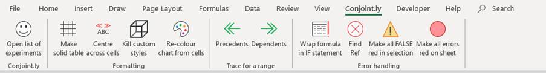

# Conjoint.ly Excel plugin
A free companion plugin for Excel that helps with charting [Conjoint.ly](https://conjointly.com/) outputs, including simulations charts from the Conjoint.ly [online simulator](https://conjointly.com/guides/conjoint-preference-share-simulator/) (scenario modelling and [price elasticity](https://conjointly.com/guides/understanding-price-elasticity-of-demand/) charts), colouring for [TURF analysis](https://conjointly.com/blog/turf-analysis/), and other useful utility functions.

**Functionality**

- **Conjoint.ly website link**
- **Formatting**:

- - **Make solid table**: Draw solid borders around      all selected cells and will make the top row text bold
  - **Centre across cells**: Place the text from the      first cell across all empty cells in that row without merging the cells
  - **Kill custom styles**: Remove all customs cell      styles
  - **Re-colour chart from cells:** Re-colour the selected      chart based on cell background colours

- **Trace for a range**: You know how you can trace     precedents and dependents for one cell in Excel? These buttons let you     check precedents and dependents for a range. These functions only find     precedents and dependents within the sheet. These functions do not show     arrows, but instead select the precedents and dependents.

- **Error handling**:

  - **Wrap formula in IF statement:** Select a range of cells      and click the button -> A self-explanatory series of dialogues will as      you how you want to convert a statement like =A1 into      =IF(A1=4,"FOUR",A1).
  - **Find Ref:** Click the button -> Selects cells that      are showing “#REF!”
  - **Format as error check range**: Select your error check      cells and click button to add conditional formatting: FALSE will be made      red, NA will be faded, TRUE and other values will be untouched
 - **Make all errors red on sheet**: Add conditional formatting to all cells on the sheet so that if there is an error (e.g., =8/0), the error cell will be red
