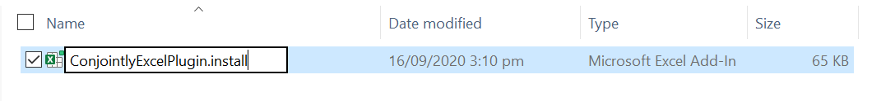
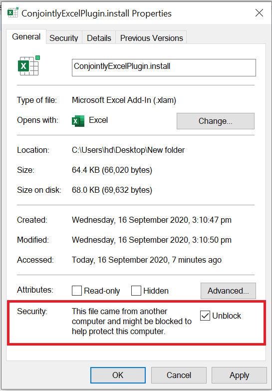
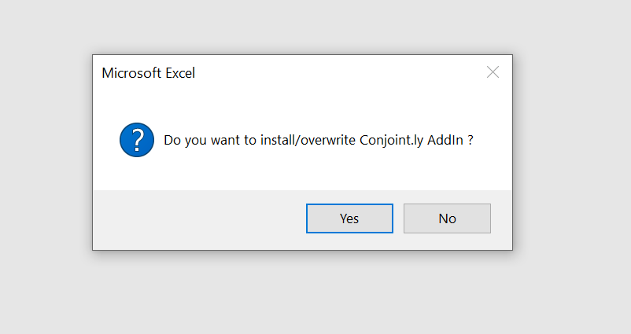
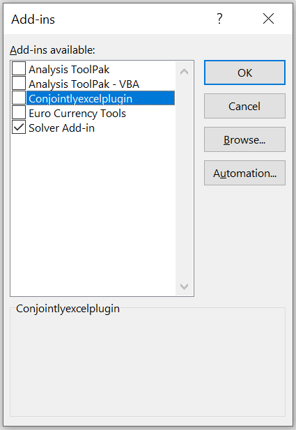
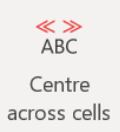
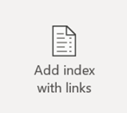

# Conjoint.ly Excel plugin
A free companion plugin for Excel that helps with charting [Conjoint.ly](https://conjointly.com/) outputs, including simulations charts from the Conjoint.ly [online simulator](https://conjointly.com/guides/conjoint-preference-share-simulator/) (scenario modelling and [price elasticity](https://conjointly.com/guides/understanding-price-elasticity-of-demand/) charts), colouring for [TURF analysis](https://conjointly.com/blog/turf-analysis/), and other useful utility functions.

## Table of Contents

1. [Installation guide (Windows 10)](#installation-guide-windows-10)
2. [How to update the add-in](#how-to-update-the-add-in)
3. [How to disable or uninstall the add-in](#how-to-disable-or-uninstall-the-add-in)
4. [Toolbar functionality](#toolbar-functionality)
5. [Elasticity function](#elasticity-function)

## Installation Guide (Windows 10)

To install the plugin, first <a download href="https://github.com/Conjoint-ly/excel-plugin/raw/master/ConjointlyExcelPlugin.xlam">download the file</a>. Once downloaded, move the file to an appropriate location in your file system. Rename the file to `ConjointlyExcelPlugin.install`.

Once the file is renamed, right-click on the file and select properties. At the bottom of the popup box is the option to unblock the file. Select unblock and then apply.

Close all current instances of Microsoft Office. By double-clicking on the file, Microsoft Excel will open, and will prompt you with the following message: 

Select yes to confirm the installation. 

## How to update the add-in

If you first installed the Conjoint.ly Excel Addin **after** September 2020, updating the plugin is easy! To update the plugin, simply download the version from Github and follow the same installation steps as above. This will automatically overwrite the existing plugin with the updated version.

If you first installed the Conjoint.ly Excel Addin **before** September 2020, you will first need to disable the preexisting plugin, following the steps below. Once completed, follow the [standard installation guide](#installation-guide-windows-10).

## How to disable or uninstall the add-in

There are two options to remove the add-in, either disabling or uninstalling. 

Disabling the plugin removes the toolbar from your Excel, but allows you to easily add it back in if needed. To disable the plugin, navigate to `Options` - `Excel Add-ins`. Select `Go` in the bottom left-hand corner of the screen. Untick the Conjoint.ly Excel Add in to disable it. 

To entirely uninstall the add-in from your computer, navigate to `Options` - `Excel Add-ins`, where you will be presented with a list of add-ins installed on your PC, as well as their file paths. Open file explorer and navigate to the file path for the Conjoint.ly Excel Add-in. From here you can entirely delete the file from your PC.

## Toolbar Functionality

| Button  | Functionality |  
| --------------------------------|--------------------------------------------------------------|
|   | Opens the user's default browser and redirects to [**Conjoint.ly**](https://conjointly.com/) |
|  | This function will **draw solid borders** around all currently highlighted cells. The text in the top row will be bolded.|
|  | Places the text from the leftmost selected cell across all selected cells. This gives the **appearance of merged cells**, but when referencing the cells, only the first cell will contain a value, the rest will be empty.|
|  | This function is an easy way to **recolour your charts based on the fill colour of the data cells your chart is based on**. To use this function, first change the background colour of your data cells to the colour you wish to display for that range on your chart. Selecting the chart and then the selecting the function will open a prompt where you can select how you want the colours to be applied. Once the options are selected, the colours will be applied to your chart. The font will also be changed to Helvetica Neue 11pt. |
|  | **Creates an index of each Excel tab** within the work book. The index is fully linked, so the title of each tab is selected the tab will be opened  | 
|  | This function will apply formatting such that **values approaching zero will be hidden**. To use this function, select a graph that you want to hide zeros on. Once the function is used, it will apply formatting to the underlying dataset to hide values approaching zero|
|  | This function **transforms conditional formatting to static formatting**. This allows the formatting to be copied onto different data points while not changing. To use the function, highlight the cells that you want to be converted then select the function. Note that this does not work for Excel's `Data Bars`|
|  | When used, this function will **show all precedents and dependents for the selected cells in a popup box**, rather than showing arrows (Which occurs with the inbuilt Excel tracing)|

## Elasticity Function
`ELASTICITY(Quantity1, Quantity2, Price1, Price2)`

Price elasticity of demand (PED) is a measurement of how quantity demanded is affected by changes in price, i.e. it shows how demand for a product increases or decreases as its price increases or decreases. 

This function calculates the coefficient of price elasticity of demand using the mid-point formula. To learn more about elasticity: https://conjointly.com/guides/understanding-price-elasticity-of-demand
